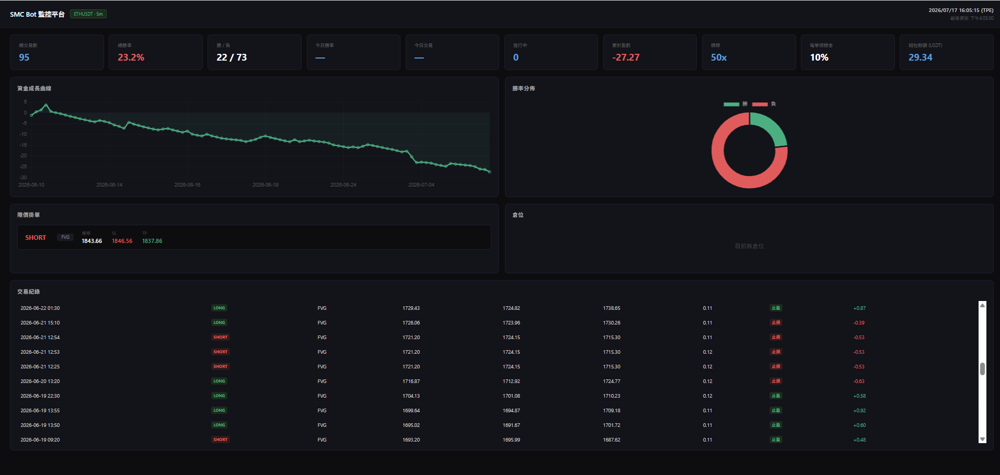

# Hi, I'm Wayne

Prop firm trader using Smart Money Concepts (SMC) strategy, building Python tools to support my trading.

---

## Projects

### [Crypto Analyzer](https://github.com/wayne1277/crypto_analyzer)
Real-time multi-symbol crypto dashboard (ETH/BTC) built with Flask and Plotly.js.

- Detects Order Blocks, Fair Value Gaps, BOS, Fake BOS, IDM, BSL/SSL
- Signal tracker: monitors entry zones and resolves Win / Loss automatically
- Live market data via Binance API; market sentiment gauge and win rate visualization
- Persistent signal storage across sessions

**Tech:** Python · Flask · Pandas · Binance API · Plotly.js · JavaScript

---

### [GDR Automation](https://github.com/wayne1277/GDR-automation)
Windows hardware validation toolkit for QA testing PCs and laptops.

- Auto-tests Audio, Battery, Display, Video, and Ethernet components
- Distinguishes auto-testable (PASS/FAIL) from manual verification items
- Generates timestamped HTML report after each run

**Tech:** PowerShell · WMI · Windows Batch

---

### [Bybit SMC Bot](https://github.com/wayne1277/Bybit-smc-bot)
Automated trading bot for Bybit Futures with multi-strategy support and Telegram controls.

- SMC strategy: detects Fair Value Gaps and Order Blocks → auto places limit orders with SL/TP
- VWAP Stdev Bands and UT Bot + Hull MA + STC as additional strategy modules
- Runtime strategy switching, daily loss guard, and live Flask monitoring dashboard

**Tech:** Python · pybit · python-telegram-bot · Flask · SQLite · Pandas

---

## Skills

`Python` `Flask` `React` `Pandas` `Binance API` `Bybit API` `Plotly.js` `REST API` `SMC / ICT`
